# Hi, I'm Samael! 👋

I am a passionate Software Engineer currently working as a Consultant for a multinational information technology services and consulting firm.

## 🚀 About Me

- 🔭 I'm currently pursuing certification in Cloud (AWS, Azure, GCP).
- 🌐 I try to stay as low profile as possible but you can definitely reach out and will reply asap.
- 👯 I’m looking to collaborate to Open Source Projects.

## Tech Stack

## 🌱 Currently Exploring

- 🚀 Exploring AI and Automation

 ## 🏆 Achievements

- 🌟 Obtained Computer Systems Engineering Degree from Universidad Autónoma de Aguascalientes

## 📬 Get in Touch

- Connect with me on [LinkedIn](https://www.linkedin.com/in/im-samael-martinez/)

<!--
**CrossHusky/CrossHusky** is a ✨ _special_ ✨ repository because its `README.md` (this file) appears on your GitHub profile.

Here are some ideas to get you started:

- 🔭 I’m currently working on ...
- 🌱 I’m currently learning ...
- 👯 I’m looking to collaborate on ...
- 🤔 I’m looking for help with ...
- 💬 Ask me about ...
- 📫 How to reach me: ...
- 😄 Pronouns: ...
- ⚡ Fun fact: ...
-->
